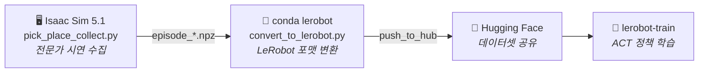

<div align="center">

# 🦾 Franka Pick-and-Place — 모방학습 (Imitation Learning)

**Franka Panda 팔이 큐브를 집어 타겟에 내려놓는 동작을, Isaac Sim 시연으로 ACT 학습**

<br>


</div>

<br>

## 📌 개요

Isaac Sim에서 **전문가 시연을 자동 수집**하고, 이를 **LeRobot 데이터셋으로 변환**해 Hugging Face에 올린 뒤, **`lerobot-train`으로 ACT 정책을 학습**하는 파이프라인입니다.

<br>



<br>

---

## 📂 파일 구성

| 파일 | 역할 |
| :--- | :--- |
| **`pick_place_collect.py`** | Isaac Sim에서 pick-place 시연 수집 → `episode_*.npz` 저장<br/>(관절 상태 + 액션 + wrist / overhead 카메라) |
| **`convert_to_lerobot.py`** | `npz` → `LeRobotDataset`(이미지+상태) 변환 후 HF 업로드 |
| **`bc_train_vision_resnet18.py`** | *(대안)* ResNet18 백본 커스텀 BC 학습 — ⚠️ **현재 보류** ([주의](#-알려진-이슈) 참고) |
| **`.gitignore`** | 데이터 · 모델 · 로그 · 이미지 등 대용량/생성물 제외 |

> 💡 **데이터셋 · 모델 · 이미지 · 로그는 git에 올리지 않습니다.**
> 데이터는 각 머신에서 생성하고, 학습 데이터셋은 Hugging Face로 공유합니다.

<br>

---

## ⚙️ 환경 설정

### 🖥️ 수집 — Isaac Sim (Windows standalone)

- Isaac Sim **5.1**
- ⚠️ **numpy 1.26.x 필수** — numpy 2.x는 OmniGraph `unknown dtype size=0` 에러 발생
- `pick_place_collect.py` 상단 경로 수정:

  ```python
  ISAACSIM_PATH = ...   # Isaac Sim 설치 경로
  SAVE_PATH     = ...   # npz 저장 폴더 (예: bc_data_v5)
  FRANKA_USD    = ...   # Franka USD 에셋 경로
  ```

### 🐧 변환 · 학습 — WSL2 / Linux 워크스테이션 (conda `lerobot`)

- conda `lerobot` 환경에 LeRobot 설치
- Hugging Face 로그인 — `huggingface-cli login`
- `convert_to_lerobot.py` 상단 설정 수정:

  ```python
  SRC     = ...   # 수집 폴더
  REPO_ID = ...   # HF 데이터셋 이름
  ```

<br>

---

## 🎯 목표하는 결과

> **학습 때 보지 못한 새로운 큐브 위치에서도 일반화되는 pick-and-place 정책.**

<br>

**❌ 문제였던 것**
초기 정책은 *본 적 있는* 위치엔 5 mm 이내로 정확히 도달했지만, *새로운* 위치는 **최대 20 cm까지 빗나감** (신규 위치 사실상 0% 성공).
→ 원인: 큐브 위치를 **넓은 연속 공간에 얇게(연속 랜덤) 흩뿌려** 수집.

**✅ 해결책 — 격자 샘플링 (`pick_place_collect.py` v8)**

| 설정 | 값 | 의미 |
| :--- | :--: | :--- |
| `CUBE_GRID_NX × NY` | `5 × 5` | 큐브 위치를 25개 고정 격자점으로 |
| `EPISODES_PER_POINT` | `12` | 지점당 12회 반복 (±1 cm 지터) |
| 타겟(놓을) 위치 | 연속 랜덤 | 유지 |

→ 지점당 **데이터 밀도**를 확보해 일반화를 유도합니다.

<br>

---

## 🚦 현재 단계

| 상태 | 단계 |
| :--: | :--- |
| ✅ | **v5 데이터 재수집 완료** — 270 에피소드 / 288,090 프레임 (wrist + overhead, 160×120) |
| ✅ | **LeRobot 포맷 변환 완료** (로컬) |
| ⏳ | **HF 업로드 보류** — 사내 프록시(Somansa) TLS 가로채기로 WSL에서 SSL 오류. 워크스테이션으로 이전 중 |
| ⏭️ | **ACT 학습 예정** — HF 데이터셋에서 `lerobot-train` CLI로 진행 |

<br>

---

## ⚠️ 알려진 이슈

<br>

**🔒 HF 업로드 SSL 오류**
사내망에서 `CERTIFICATE_VERIFY_FAILED` (Somansa Root CA)로 huggingface.co 업로드가 막힘.
→ Somansa 루트 CA를 신뢰시키거나, 프록시 밖 네트워크에서 업로드해야 함.

<br>

**🧩 `bc_train_vision_resnet18.py` 그대로 재사용 금지**
`REPO_ID`가 옛 데이터셋(`jamongsteak/pickplace_vision`), `PROPRIO_DIM=18`(구 스펙)로 하드코딩됨.
현재 변환 스크립트는 `PROPRIO_DIM=9`(joint_pos만)이므로, BC 경로를 다시 쓰려면 두 값을 먼저 맞춰야 함.
지금은 ACT에 집중하느라 보류.
