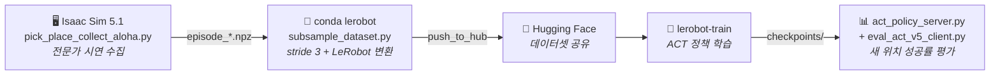

<div align="center">

# 🦾 Franka Pick-and-Place — 모방학습 (Imitation Learning)

**Franka Panda 팔이 큐브를 집어 타겟에 내려놓는 동작을, Isaac Sim 시연으로 ACT 학습**

<br>


</div>

<br>

## 📌 개요

Isaac Sim에서 **전문가 시연을 자동 수집**하고, **3프레임마다 솎아 LeRobot 데이터셋으로 변환**해 Hugging Face에 올린 뒤, **`lerobot-train`으로 ACT 정책을 학습**하고, **정책 서버 + 시뮬 클라이언트**로 새 위치에서 성공률을 평가하는 파이프라인입니다.

<br>



<br>

---

## 📂 파일 구성

| 파일 | 역할 |
| :--- | :--- |
| **`scene_config.py`** | **씬 설정의 단일 출처** — 카메라 위치·focal·해상도·조명·큐브 영역·평가 격자.<br/>수집과 평가가 이 파일 하나를 함께 읽는다 ([왜](#-왜-scene_configpy가-있나) 참고) |
| **`pick_place_collect_aloha.py`** | Isaac Sim에서 pick-place 시연 수집 → `episode_*.npz`<br/>(관절 상태 + 액션 + wrist / overhead 카메라). 성공한 에피소드만 저장 |
| **`subsample_dataset.py`** | `npz` → `LeRobotDataset` 변환. **stride 3으로 솎는다**(60Hz → 20Hz).<br/>`--analyze`로 stride 후보를 데이터로 먼저 검토 가능 |
| **`act_policy_server.py`** | 학습된 ACT 체크포인트를 로드해 소켓으로 액션을 서비스 (conda `lerobot`) |
| **`eval_act_v5_client.py`** | Isaac Sim 쪽 평가 클라이언트. 16개 새 위치에서 성공률 측정 |
| **`cam_tune.py`** | GUI로 카메라를 잡는 도구. 큐브가 몇 픽셀로 보이는지 실시간 표시 |
| **`cam_occlusion_compare.py`** | 카메라 구도 비교 캡처 (천장뷰 vs 경사뷰, 같은 궤적·같은 순간) |
| **`diag_dataset_images.py`** | 수집된 데이터의 이미지 진단 — 밝기 통계 + 큐브 픽셀 크기 |
| **`bc_train_vision_resnet18.py`** | *(대안 경로)* ResNet18 백본 커스텀 BC 학습 |
| **`.gitignore`** | 데이터 · 모델 · 로그 · 이미지 등 대용량/생성물 제외 |

> 💡 **데이터셋 · 모델 · 이미지 · 로그는 git에 올리지 않습니다.**
> 데이터는 각 머신에서 생성하고, 학습 데이터셋은 Hugging Face로 공유합니다.

<br>

### 🧩 왜 `scene_config.py`가 있나

카메라·조명 값이 수집 스크립트와 평가 스크립트에 각각 복사돼 있었고, 실제로 어긋났습니다 — **수집은 조명 1500, 평가는 1000.** 도메인 랜덤화를 끈 상태였으므로 정책은 1500만 본 적이 있었고, 평가에서는 학습 분포 밖의 이미지를 받았습니다. 이런 종류의 버그는 에러 없이 성공률 0%로만 나타나서 원인을 찾기가 아주 어렵습니다.

그래서 씬을 정의하는 모든 숫자를 한 파일에 모았습니다. 평가 격자도 `CUBE_*_RANGE`에서 자동 계산되므로, 학습 영역을 바꾸면 평가 위치가 따라옵니다.

<br>

---

## ⚙️ 환경 설정

### 🖥️ 수집 · 평가(시뮬) — Isaac Sim

- Isaac Sim **5.1**
- ⚠️ **numpy 1.26.x 필수** — numpy 2.x는 OmniGraph `unknown dtype size=0` 에러 발생
- 실행: `/data/isaacsim/python.sh script.py` (Linux) / `C:\isaacsim\python.bat -u script.py` (Windows)
- `SAVE_PATH`만 환경에 맞게 수정 (나머지 씬 설정은 `scene_config.py`)

### 🐧 변환 · 학습 · 평가(정책) — conda `lerobot`

- conda `lerobot` 환경에 LeRobot 설치 (Python 3.12 / numpy 2.x)
- Hugging Face 로그인 — `huggingface-cli login`

> ⚠️ **두 환경은 한 프로세스에 못 올립니다.** Isaac Sim은 py3.11/numpy1.26, lerobot은 py3.12/numpy2.x입니다. 그래서 평가를 **정책 서버 + 시뮬 클라이언트**로 쪼개 소켓으로 통신합니다.
>
> ⚠️ **tmux는 창마다 `.bashrc`를 새로 읽습니다.** 밖에서 한 `conda activate`는 따라오지 않으니 창 안에서 다시 해야 합니다.

<br>

---

## 🎯 목표하는 결과

> **학습 때 보지 못한 새로운 큐브 위치에서도 일반화되는 pick-and-place 정책.**

<br>

### ALOHA 표준 세팅

ACT 계열에서 "50 에피소드면 된다"는 결과들은 전부 **물체는 랜덤 / 놓을 곳은 고정**입니다. v8은 큐브만 격자로 고정하고 목표는 매번 새로 뽑아서, 300 에피소드가 전부 서로 다른 태스크였습니다.

| 설정 | 값 | 의미 |
| :--- | :--: | :--- |
| 큐브 초기 위치 | **연속 랜덤** | 20×20cm, 중심 (0.425, 0.150) — ALOHA sim과 같은 밀도 |
| 놓을 위치 | **고정** | (0.500, −0.150) ±5mm — 성공 허용오차(5cm)의 1/10 |
| 에피소드 | 50 | ALOHA 표준 규모 |
| 도메인 랜덤화 | OFF | 성공률이 올라온 뒤에 켠다 |

큐브 영역의 y가 전부 양수인 건 목표가 y=−0.150이고 `MIN_DISTANCE=0.15`를 영역 **전체**가 만족해야 사각형이 깎이지 않기 때문입니다(이 영역의 목표까지 최소거리 0.202m). 대신 y<0 쪽에서 집는 건 배우지 못합니다.

<br>

### 학습량 계산

50 × 1067 = 53,350 프레임을 stride 3으로 솎으면 약 17,800 프레임입니다. lerobot 기본값 `--steps=100000 --batch_size=8`이면 80만 샘플 = **약 45 에폭**으로, ACT 표준 레시피와 같은 수준입니다.

```bash
lerobot-train --policy.type=act --dataset.repo_id=<repo> --policy.push_to_hub=false \
  --steps=100000 --batch_size=8 --save_freq=20000 --output_dir=/data/jinju/act_pickplace_v10
```

> ⚠️ stride 3으로 학습한 정책은 20Hz로 판단합니다. 물리는 60Hz로 도니 **추론 시 액션 하나를 3스텝 유지**해야 합니다 (`ACTION_REPEAT=3`).

<br>

---

## 🚦 현재 단계

| 상태 | 단계 |
| :--: | :--- |
| ✅ | **카메라 구도 전면 교체** — 천장 수직뷰 → 정면 경사뷰, 160×120 → 320×240 |
| ⏭️ | **v10 데이터 수집** — `bc_data_v10`, 50 에피소드 |
| ⏭️ | 변환 (stride 3) → 학습 (100k step) → 평가 (16개 새 위치) |

<br>

---

## ⚠️ 지금까지 찾은 실패 원인들

성공률 0%가 반복됐고, 원인이 **네 개**였습니다. 모두 에러 없이 조용히 실패하는 종류였습니다.

<br>

**1️⃣ 평가 하네스가 검은 이미지를 먹이고 있었다**
`world.step(render=not HEADLESS)` — headless에서 `render=False`면 `Camera.get_rgba()`가 빈 배열을 돌려주고, 이미지 획득 함수가 그걸 조용히 0으로 채웠습니다. 수집은 `RENDER=True`로 돌았으니 평가만 어긋난 것입니다.
→ `RENDER`를 `HEADLESS`와 분리. 검은 프레임 카운터(`blank_camera_frames`)를 결과에 남겨 재발을 감시합니다.

<br>

**2️⃣ 그리퍼 값이 이진값인데 정책은 회귀 모델이다**
학습 데이터의 그리퍼는 `0.025`(닫힘) / `0.04`(열림) 두 값뿐인데, ACT는 그 사이 값을 냅니다. 큐브가 5cm라 **5mm만 더 벌어져도 아예 못 잡습니다.**
→ 평가에서도 수집과 똑같이 이진화 (`binarize_gripper`).

<br>

**3️⃣ 평가 위치의 절반이 학습 영역 밖이었다**
큐브 영역을 20×20cm로 좁힌 뒤에도 평가 위치는 예전 목록을 쓰고 있었습니다. 15개 중 8개가 학습한 적 없는 곳이었습니다.
→ 평가 격자를 `CUBE_*_RANGE`에서 자동 계산.

<br>

**4️⃣ 카메라가 큐브를 못 보고 있었다 — 가장 큰 원인**
`diag_dataset_images.py`로 측정한 결과:

| 시점 | 오버헤드에서 큐브 |
| :--- | :--- |
| t=0 | **5px** (5cm 큐브가 6픽셀. 화면의 97%가 빈 바닥이었다) |
| t=60 이후 | **0px** — 팔이 큐브를 가린다 |

천장에서 수직으로 내려보는 구도라, 팔이 집으러 들어가는 순간부터 팔 몸통이 큐브를 가렸습니다. 게다가 큐브가 x≥0.5에 있으면 손목 카메라 화각도 벗어나서, **그 위치들은 정책에 큐브 정보가 아예 없었습니다.**

→ 정면에서 50° 내려보는 경사뷰로 교체 + 해상도 2배 + focal 24→60mm. 큐브가 다섯 위치 전부에서 **18~26px**로 보입니다.

<br>

---

## 🔧 진단 도구

문제가 조용히 실패하는 종류였기 때문에, 추측 대신 측정하는 도구를 남겨뒀습니다.

```bash
# 수집된 데이터의 이미지에 큐브가 실제로 보이는가 (밝기 통계 + 큐브 픽셀)
python diag_dataset_images.py --src /data/jinju/bc_data_v10 --outdir /tmp/imgs

# 카메라 구도 잡기 (GUI, 다섯 위치에서 큐브 픽셀 실시간 표시)
C:\isaacsim\python.bat -u cam_tune.py

# 구도 비교 캡처 (같은 궤적을 두 카메라로 동시 촬영)
C:\isaacsim\python.bat -u cam_occlusion_compare.py

# 씬 설정과 평가 격자 확인
python scene_config.py
```

평가 결과 JSON에서 이 순서로 읽습니다:

1. **`blank_camera_frames`** — 0이 아니면 나머지 숫자는 무의미
2. **`success_rate`**
3. **`ee_at_close_std`** — 손을 닫은 지점의 산포. 큐브가 20×20cm에 퍼져 있으니 정책이 큐브를 보고 있다면 수 cm가 나와야 합니다. 1cm 미만이면 큐브와 무관하게 늘 같은 곳으로 가고 있다는 뜻입니다
4. **`avg_min_ee_cube`** — 손이 큐브에 얼마나 가까이 갔는가

<br>

---

## ⚠️ 알려진 이슈

**🔒 HF 업로드 SSL 오류 (데스크톱 WSL)**
사내망에서 `CERTIFICATE_VERIFY_FAILED` (Somansa Root CA)로 huggingface.co 업로드가 막힙니다. **워크스테이션에서는 정상 동작**하므로 변환·업로드는 그쪽에서 합니다.

<br>

**🖥️ 드라이버 버전 불일치**
`Failed to initialize NVML: Driver/library version mismatch` — apt가 nvidia 패키지를 올렸지만 커널 모듈은 예전 것이 로드된 상태입니다. `dkms status`로 현재 커널에 새 모듈이 `installed`인지 확인한 뒤 재부팅하면 해결됩니다. 595.x 계열은 Isaac Sim의 CUDA 감지를 깨뜨리므로 580.x를 유지할 것.

<br>

**🧩 lerobot fork별 모듈 배치 차이**
같은 0.6.1인데도 `lerobot.utils.control_utils` vs `lerobot.common.control_utils`처럼 경로가 다릅니다. `act_policy_server.py`는 두 경로를 모두 시도합니다.
