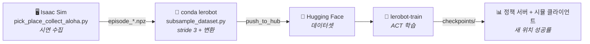

<div align="center">

# 🦾 Franka Pick-and-Place — 모방학습 (Imitation Learning)

**Isaac Sim 전문가 시연으로 ACT 정책을 학습해, 학습 때 보지 못한 큐브 위치에서 pick-and-place**

<br>


-brightgreen?style=flat-square)

</div>

<br>

## 📌 개요

Isaac Sim에서 **전문가 시연을 자동 수집** → **3프레임마다 솎아 LeRobot 데이터셋으로 변환** → **`lerobot-train`으로 ACT 학습** → **정책 서버 + 시뮬 클라이언트로 새 위치에서 성공률 측정**.

**v10 결과: 학습 때 본 적 없는 16개 좌표에서 성공률 75% (12/16).** 성공한 에피소드는 큐브를 26~29cm 들어올려 목표에서 1~8mm 안에 내려놓습니다.

<br>



<br>

---

## 🚀 전체 실행 순서

```bash
# 0) 설정 확인 — 카메라·영역·그리퍼·평가격자가 한눈에 나온다
python scene_config.py

# 1) 수집 (Isaac Sim, tmux 권장)
/data/isaacsim/python.sh pick_place_collect_aloha.py

# 2) 수집 검증 — 학습을 시작하기 전에 반드시
python diag_dataset_images.py --src /data/jinju/bc_data_v11 --outdir /tmp/imgs
python diag_grasp_timing.py  --src /data/jinju/bc_data_v11

# 3) 변환 + Hub 업로드 (conda lerobot)
python subsample_dataset.py --src /data/jinju/bc_data_v11 \
    --repo-id <user>/pickplace_vision_v11_s3 --push

# 4) 학습
lerobot-train --policy.type=act --dataset.repo_id=<user>/pickplace_vision_v11_s3 \
    --policy.push_to_hub=false --steps=150000 --batch_size=8 \
    --save_freq=30000 --output_dir=/data/jinju/act_pickplace_v11

# 5) 모델 Hub 업로드
huggingface-cli upload <user>/act_pickplace_v11 \
    /data/jinju/act_pickplace_v11/checkpoints/150000/pretrained_model

# 6) 평가 — 창 2개
python act_policy_server.py                      # MODEL_PATH=... 로 체크포인트 지정
/data/isaacsim/python.sh -u eval_act_v5_client.py
```

> `--steps`는 **프레임 수 × 목표 에폭 ÷ batch**로 정합니다. 70 에피소드 × 1067 ÷ 3 ≈ 24,900 프레임이므로 150k step × batch 8 = 120만 샘플 ≈ **48 에폭**입니다. 변환 로그의 실제 프레임 수로 재계산하세요.

<br>

---

## 📂 파일 구성

| 파일 | 역할 |
| :--- | :--- |
| **`scene_config.py`** | **모든 씬 설정의 단일 출처** — 카메라·해상도·조명·큐브 영역·그리퍼 값·솎기 stride·평가 격자. 수집과 평가가 이 파일 하나를 함께 읽는다 ([왜](#-왜-단일-출처가-필요했나)) |
| **`pick_place_collect_aloha.py`** | 시연 수집 → `episode_*.npz` (관절 + 액션 + wrist/overhead 이미지). 성공한 에피소드만 저장. `FRESH_START=1`로 기존 파일 삭제 후 새로 수집 |
| **`subsample_dataset.py`** | `npz` → `LeRobotDataset`. stride 3으로 솎아 60Hz → 20Hz. `--analyze`로 stride 후보를 데이터로 검토 |
| **`act_policy_server.py`** | 체크포인트를 로드해 소켓으로 액션 서비스 (conda `lerobot`). `TEMPORAL_ENSEMBLE` / `N_ACTION_STEPS`로 폐루프 실험 가능 |
| **`eval_act_v5_client.py`** | Isaac Sim 평가 클라이언트. 16개 새 위치에서 성공률 + 파지 기하 측정 |
| **`diag_dataset_images.py`** | 수집 데이터 진단 — 밝기 통계, **큐브가 몇 픽셀로 보이는지** |
| **`diag_grasp_timing.py`** | 시연의 파지 기하 측정 — 그리퍼를 닫는 순간의 손-큐브 상대좌표 |

> 💡 데이터셋 · 모델 · 이미지 · 로그는 git에 올리지 않습니다. 데이터는 각 머신에서 생성하고 Hugging Face로 공유합니다.
>
> 💡 카메라 값을 잡거나 그림을 뽑는 데 쓴 **일회성 도구**(`cam_tune.py`, `cam_occlusion_compare.py`, `show_eval_positions.py`, `plot_sweep.py`, `eval_sweep.sh`, `fix_checkpoint_for_isaacsim.py`)는 저장소에 두지 않습니다. 결과는 이미 `scene_config.py`와 이 문서에 반영돼 있습니다.

<br>

### 🧩 왜 단일 출처가 필요했나

카메라·조명 값이 수집 스크립트와 평가 스크립트에 각각 복사돼 있었고, 실제로 어긋났습니다 — **수집 조명 1500, 평가 1000.** 도메인 랜덤화를 끈 상태였으니 정책은 1500만 본 적이 있었고, 평가에서는 학습 분포 밖의 이미지를 받았습니다.

이 종류의 버그는 **에러 없이 성공률 0%로만** 나타납니다. 그래서 씬을 정의하는 모든 숫자를 한 파일에 모았습니다. 평가 격자와 `ACTION_REPEAT`도 자동 계산되므로 손으로 맞출 일이 없습니다.

<br>

---

## ⚙️ 환경

### 🖥️ 수집 · 평가(시뮬) — Isaac Sim 5.1

- ⚠️ **numpy 1.26.x 필수** — 2.x는 OmniGraph `unknown dtype size=0` 에러
- `/data/isaacsim/python.sh script.py` (Linux) / `C:\isaacsim\python.bat -u script.py` (Windows)
- `SAVE_PATH`만 환경에 맞게 수정 (나머지는 `scene_config.py`)

### 🐧 변환 · 학습 · 평가(정책) — conda `lerobot`

- LeRobot 0.6.1 (Python 3.12 / numpy 2.x), `huggingface-cli login`

> ⚠️ **두 환경은 한 프로세스에 못 올립니다.** 그래서 평가를 **정책 서버 + 시뮬 클라이언트**로 쪼개 소켓으로 통신합니다.
>
> ⚠️ **tmux는 창마다 `.bashrc`를 새로 읽습니다.** 밖에서 한 `conda activate`는 따라오지 않습니다.
>
> ⚠️ Isaac Sim은 종료 시 버퍼링된 stdout을 버립니다 — 항상 **`-u`**로 실행하세요.

<br>

---

## 🎯 태스크 설계

ACT 계열에서 "50 에피소드면 된다"는 결과들은 전부 **물체는 랜덤 / 놓을 곳은 고정**입니다. v8은 큐브만 격자로 고정하고 목표는 매번 새로 뽑아서, 300 에피소드가 전부 서로 다른 태스크였습니다.

| 설정 | 값 |
| :--- | :--- |
| 큐브 초기 위치 | **연속 랜덤** 24×24cm, 중심 (0.425, 0.150) |
| 놓을 위치 | **고정** (0.500, −0.150) ±5mm |
| 에피소드 | 70 (영역이 넓어진 만큼 밀도 유지) |
| 도메인 랜덤화 | OFF (성공률이 올라온 뒤에 켠다) |
| 평가 위치 | 수집 영역에서 **2cm 안쪽** 4×4 격자 16개 |

큐브 영역의 y가 전부 양수인 건 목표가 y=−0.150이고 `MIN_DISTANCE=0.15`를 영역 **전체**가 만족해야 사각형이 깎이지 않기 때문입니다. 대신 y<0 쪽에서 집는 건 배우지 못합니다.

**평가 격자를 수집 영역보다 안쪽에 두는 이유:** v10은 둘이 같았고, 경계행(y=0.050)이 **1/4**, 내부는 **11/12**였습니다. 연속 랜덤 수집에서 경계점은 이웃 데이터가 한쪽에만 있어 학습이 얇아집니다.

<br>

---

## ⚠️ 지금까지 찾은 실패 원인 (네 개, 전부 조용히 실패)

성공률 0%가 세 번 반복됐고 원인이 네 개였습니다. **하나도 예외 없이 에러를 내지 않았습니다.**

<br>

**1️⃣ 평가 하네스가 검은 이미지를 먹였다**

`world.step(render=not HEADLESS)` — headless에서 `render=False`면 `Camera.get_rgba()`가 빈 배열을 돌려주고, 이미지 획득 함수가 그걸 조용히 0으로 채웠습니다. 수집은 `RENDER=True`로 돌았으니 평가만 어긋났습니다.
→ `RENDER`를 `HEADLESS`와 분리. 검은 프레임 카운터(`blank_camera_frames`)를 결과 JSON에 남겨 재발 감시.

<br>

**2️⃣ 조명이 수집 1500 / 평가 1000이었다**

→ `scene_config.py`로 통합.

<br>

**3️⃣ 카메라가 큐브를 못 봤다**

`diag_dataset_images.py`로 측정한 결과:

| 시점 | 천장 수직뷰(160×120)에서 큐브 |
| :--- | :--- |
| t=0 | **5px** (화면의 97%가 빈 바닥) |
| t=60 이후 | **0px** — 팔이 큐브를 가린다 |

게다가 큐브가 x≥0.5면 손목 카메라 화각도 벗어나서, **평가 위치의 절반은 정책에 큐브 정보가 아예 없었습니다.**

→ 정면에서 50° 내려보는 경사뷰 (2,0,2)/focal 60/320×240. 큐브가 다섯 위치 전부에서 **18~26px**, 전 구간 가림 없음.

<br>

**4️⃣ 그리퍼 라벨이 실제 명령과 달랐다 — 마지막 관문**

수집 스크립트는 로봇에 컨트롤러 **원본** 명령을 주면서(`franka.apply_action(action)`) 데이터셋에는 **0.025**로 덮어써 저장했습니다. 0.025는 손가락당 2.5cm = 총 개구 **5.0cm**로 큐브 폭과 정확히 같아서, 정책이 배운 대로 명령하면 **닿기만 하고 미는 힘이 0**입니다.

**같은 체크포인트에서 닫힘 명령만 0.0으로 바꾸자 0% → 75%.** 재학습 없이 한 줄이었습니다.

→ 라벨과 명령을 `scene_config.GRIPPER_CLOSED`(0.0) 하나로 통일. 수집 시 원본 명령값을 매 에피소드 출력해 재발 감시.

<br>

### 🙅 헛짚었던 가설 두 개

기록을 남겨둡니다. **조기 폐쇄**와 **개루프 계획 정체**를 의심해 temporal ensembling과 `n_action_steps` 축소를 시도했으나 둘 다 아무 변화가 없었습니다.

`diag_grasp_timing.py`로 **시연 자체의 파지 기하**를 재보니 시연도 손-큐브 3.9cm에서 닫는 게 정상이었습니다 — `franka.end_effector`가 `panda_hand` 프레임이라 손가락 끝보다 4cm 위이기 때문입니다. **평가값만 보고 기준값을 재지 않은 것이 오진의 원인이었습니다.**

<br>

---

## 🔧 진단 순서

문제가 조용히 실패하는 종류이므로, 추측 전에 재는 순서를 정해두었습니다.

**수집 직후 — 학습 시작 전에 반드시:**

```bash
python diag_dataset_images.py --src /data/jinju/bc_data_v11
```
→ `over 빨강`이 t=0뿐 아니라 t=60, 120, 240에서도 0이 아니어야 합니다. 0이면 카메라가 가려지는 것이므로 **학습해도 무의미합니다.**

```bash
python diag_grasp_timing.py --src /data/jinju/bc_data_v11
```
→ 시연이 그리퍼를 닫는 순간의 손-큐브 상대좌표. 평가값과 비교할 **기준값**입니다.
v10 기준: `dx +0.0009, dy −0.0392, dz −0.0485` (47개 표준편차 0.2mm)

**평가 결과 JSON은 이 순서로 읽습니다:**

1. **`blank_camera_frames`** — 0이 아니면 나머지 숫자는 전부 무의미
2. **`success_rate`**
3. **`ee_at_close_std`** — 손을 닫은 지점의 산포. 큐브가 24×24cm에 퍼져 있으니 정책이 큐브를 보고 있다면 **수 cm**가 나와야 합니다. 1cm 미만이면 큐브와 무관하게 늘 같은 곳으로 가고 있다는 뜻입니다
4. **`cube_rel_at_close`** — 시연 기준값과 세 축을 각각 비교. **dz를 빼놓지 말 것** (XY가 맞아도 손이 높으면 허공을 잡습니다)
5. **`min_ee_cube`** — 손이 큐브에 접근한 최소 거리

<br>

---

## 📈 버전 히스토리

| | v5 | v9 | **v10** | v11 (진행) |
| :--- | :--- | :--- | :--- | :--- |
| 큐브 영역 | 25×50cm | 20×20cm | 20×20cm | **24×24cm** |
| 목표 위치 | 연속 랜덤 | 고정 | 고정 | 고정 |
| 에피소드 | 270 | 50 | 47 | **70** |
| 해상도 | 160×120 | 160×120 | **320×240** | 320×240 |
| 오버헤드 카메라 | 천장 수직 | 천장 수직 | **정면 경사** | 정면 경사 |
| 학습량 | 2.6 에폭 | — | **47.7 에폭** | ~48 에폭 |
| 그리퍼 라벨 | 0.025 ✗ | 0.025 ✗ | 0.025 ✗ (평가에서 보정) | **0.0 ✓** |
| **성공률** | 0% | 0% | **75%** | ? |

<br>

---

## ⚠️ 알려진 이슈

**🔒 HF 업로드 SSL (데스크톱 WSL)** — 사내 프록시(Somansa Root CA)로 `CERTIFICATE_VERIFY_FAILED`. **워크스테이션에서는 정상**이므로 변환·업로드는 그쪽에서 합니다.

**🖥️ 드라이버 버전 불일치** — `Failed to initialize NVML: Driver/library version mismatch`는 apt가 nvidia 패키지를 올렸지만 커널 모듈은 예전 것이 로드된 상태입니다. `dkms status`로 현재 커널에 새 모듈이 `installed`인지 확인 후 재부팅. **595.x는 Isaac Sim CUDA 감지를 깨뜨리므로 580.x 유지.**

**🧩 lerobot fork별 모듈 경로 차이** — 같은 0.6.1인데도 `lerobot.utils.control_utils` vs `lerobot.common.control_utils`. `act_policy_server.py`는 두 경로를 모두 시도합니다.

**🔁 변환 중단 시** — `FileExistsError: .../hf_cache/lerobot/<repo>`. 이어받기가 없으므로 해당 폴더를 지우고 다시 시작해야 합니다.

**🔁 학습 중단 시** — `--output_dir`이 이미 있으면 거부합니다. 체크포인트가 있으면 `--config_path=<...>/checkpoints/last/pretrained_model/train_config.json --resume=true`, 없으면 폴더를 지우고 재시작.
